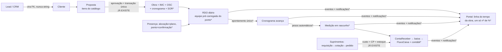

# Fluxo ideal — entrada única, zero retrabalho, a história contada

> Documento vivo. Primeira rodada: **2026-07-30**.
> Estudo pedido pelo dono do produto: "um app em que a informação entra UMA
> vez, sem retrabalho; o fluxo de dados de uma construtora perfeito; a
> história do cliente contada; tudo bem visualizado."
>
> **Método:** 14 agentes de análise leram o código em paralelo (13 módulos
> funcionais + 1 jornada ponta-a-ponta), com evidência `arquivo:linha` por
> achado. Resultado bruto em `docs/estudo-fluxo/analises-2026-07-30.json`.
> Mapa de módulos/rotas/modelos em `MODULOS.md`. **Cada achado citado aqui
> deve ser reconfirmado no código antes de virar mudança** — é para isso que
> existe a marca `Conferência:` do MODULOS.md.

---

## 1. O veredicto em uma página

**A espinha dorsal do fluxo ideal JÁ EXISTE — e é boa.** Aprovar uma proposta
materializa, numa única transação: Obra + Cliente (com dedup) + itens de
medição (IMC) + snapshots de custo (OSC) + cronograma com linhagem por item
(`event_manager.py:882`, `handlers/propostas_handlers.py`). RDO finalizado
lança custo, recalcula medição e faz upsert de ContaReceber. Compra aprovada
gera custo + conta a pagar + estoque. O evento `proposta_aprovada` é o melhor
padrão da casa.

**O problema não é a espinha — são as pontas e as costuras.** O retrabalho se
concentra em sete padrões que se repetem em todos os módulos:

1. **Elos com prefill morto.** O elo existe pela metade: o CRM manda
   `?cliente_id=&lead_id=` para a nova proposta e a rota **ignora os params**
   (`crm_views.py:937` → `propostas_consolidated.py:507`); a FK
   `AlocacaoEquipe.rdo_gerado_id` existe e nenhum código a preenche; o e-mail
   do signatário está no banco e nunca é enviado.

2. **Tabelas paralelas para o mesmo fato.** Dois ledgers de custo (`CustoObra`
   V1 × `GestaoCustoFilho` V2), duas tabelas de serviço-na-obra
   (`servico_obra` × `servico_obra_real` — e o RDO lê as duas em pontos
   diferentes), duas de alimentação, **três** modelos de alocação de equipe,
   Restaurante × Fornecedor, e **quatro planos de contas concorrentes** (o
   código 5.1.01 é "MÃO DE OBRA" num plano e "Materiais Diretos" noutro —
   `contabilidade_utils.py:509`).

3. **Identidade como string, não FK.** `Proposta.cliente_nome/telefone/email`
   digitados livres (proposta manual nasce **sem** `cliente_id`);
   `ContaReceber.cliente_nome` texto; fornecedor da frota texto;
   `RDOEquipamento.nome_equipamento` texto; cronograma-cliente sincronizado
   **por igualdade de `nome_tarefa`** (`portal_obras_views.py:198-210`) —
   renomear a tarefa congela o % no portal.

4. **A mesma realidade digitada 2–3×.** A campeã: **presença** — alocada na
   segunda (AllocationEmployee), batida no ponto (RegistroPonto), redigitada
   no RDO (RDOMaoObra); nenhuma linha dos fluxos de RDO lê as outras duas.
   Progresso físico digitado 2× no MESMO formulário de RDO (subatividade → 
   medição; apontamento → cronograma, sem ponte). Cotação digitada no
   planejamento e de novo no mapa de concorrência.

5. **Duas fórmulas para o mesmo número.** Progresso da obra: média simples no
   dashboard e no `gerar_medicao` do portal × métrica ponderada v2 no anel —
   **o cliente vê 11,67% no anel e medição de 8,75% logo abaixo**
   (`portal_obras_views.py:745-768`). Custo total da obra: V1 e V2 divergem.
   Dois geradores de medição coexistem.

6. **Dado que entra e morre.** CPF/CNPJ digitado na proposta é **descartado**
   (`propostas_consolidated.py:559` → evento manda `None`); encargos patronais
   calculados e não persistidos (custo de mão de obra ~28% subestimado); foto,
   GPS e confiança facial do ponto nunca aparecem em lugar nenhum; comprovante
   enviado pelo cliente no portal só grava URL e ninguém é avisado; o
   "Efetivo" do WhatsApp da Baia vira texto e a obra fica sem custo de mão de
   obra.

7. **Comunicação morta.** `NotificacaoCliente` existe como modelo e **nenhum
   código de produção cria registros**; `emit_obra_cronograma_atualizado` e
   `emit_obra_concluida` têm workflow n8n pronto e emissor implementado — 
   **zero callers**; o portal é 100% passivo; agendamento de relatórios grava
   num dict em memória e o job morre no fim do request.

**Achados graves de brinde** (fora do escopo "fluxo", mas urgentes):

- **Vazamento multi-tenant:** 7 relatórios e 3 exportações de
  `relatorios_funcionais.py` **não filtram `admin_id`** — um admin exporta
  funcionários, ponto, custos e obras de todas as empresas (linhas 60–266,
  456–569). Há ainda fallbacks "admin com mais dados" (`views/obras.py:1520`,
  `views/rdo.py:2274`).
- **Dupla contagem de custo:** ponto × RDO criam `CustoObra` para o mesmo
  funcionário/data/obra por handlers distintos (`event_manager.py:487` e
  `:714`); combustível real + tarifa hardcoded R$ 0,80/km; migração
  ContaPagar→GCP deixa a **mesma dívida pagável em duas filas**
  (`gestao_custos_views.py:1328-1403`).
- **Telas-fachada:** analytics preditivos retorna mock/lista vazia nos 11
  métodos de dados (score fixo 75); dashboards de frota quebrados em silêncio;
  gráficos de relatórios chamam rota que não existe.

---

## 2. O fio ideal

O desenho a perseguir — cada informação nasce UMA vez, no lugar onde o fato
acontece, e escoa por FK e evento:

(* = não existe hoje; o resto já existe e fica.)

**Princípios de projeto** (o crivo para toda mudança futura):

1. **FK sempre; snapshot só quando precisa congelar** — e aí é gerado do
   cadastro, nunca digitável.
2. **O evento materializa; a tela só confirma.** O padrão
   `proposta_aprovada` estendido a todos os elos.
3. **Um fato, um registro.** Presença é UM registro com estados
   (planejada → confirmada → apontada), não três tabelas.
4. **Um número, uma fórmula.** Progresso, custo total e medição saem da mesma
   função, servida a dashboard, medição e portal.
5. **Um ledger de custo.** `GestaoCustoFilho` canônico; `CustoObra` vira
   leitura legada.
6. **Todo dado coletado aparece em algum lugar** — ou não é coletado.
7. **A história é push, não pull.** O cliente é avisado; o portal é a
   linha do tempo, não uma pilha de seções.

---

## 3. A jornada hoje — onde o fio arrebenta, elo a elo

| # | Elo | Estado | O que quebra |
|---|-----|--------|--------------|
| 1 | Lead → Proposta | 🔴 | Prefill morto: params ignorados, cliente redigitado como texto, proposta manual sem `cliente_id`; CPF/CNPJ descartado |
| 2 | Proposta ↔ Lead | 🔴 | Nenhum handler fecha o lead (ganho/perdido/obra_id); kanban manual |
| 3 | Orçamento → Proposta | 🟢 | Copia itens, composição, cronograma-default, cláusulas — o elo modelo |
| 4 | Proposta → Obra/IMC/OSC/cronograma | 🟢 | Transação única, dedup de cliente, linhagem por item |
| 5 | Proposta → Serviços da obra (SOR) | 🔴 | **Nenhum handler semeia ServicoObraReal** — a obra nasce vazia para o RDO e o GP re-seleciona tudo |
| 6 | Custo orçado → baseline da obra | 🔴 | `OSC.valor_orcado` herda o valor de **venda**, não o custo (`models.py:7466`); baseline inflado pela margem |
| 7 | Alocação/Ponto → RDO | 🔴 | Zero leitura; presença digitada até 3× |
| 8 | RDO → custo | 🟡 | Funciona, mas: 3 telas de escrita com efeitos desiguais, falha engolida por try/except, dupla contagem com ponto |
| 9 | RDO → cronograma → medição | 🟡 | Dois trilhos de progresso sem ponte; vínculo IMC↔tarefa manual com soma-100% obrigatória, apesar da linhagem comum |
| 10 | Medição → ContaReceber → caixa | 🔴 | Import de extrato cria **CR nova** em vez de baixar a OBR-MED; baixa manual não gera FluxoCaixa; dois geradores de medição |
| 11 | Custo → contabilidade | 🔴 | `DESPESA_GERAL` não existe no mapeamento — a maior parte das despesas nunca contabiliza; integrações prontas sem gatilho |
| 12 | Obra → Portal | 🟡 | Portal existe e tem ciência assinada, mas: cronograma-cliente por nome, dois %, 20 RDOs, capítulo comercial invisível, zero notificação |
| 13 | WhatsApp → RDO (Baia) | 🟡 | Pipeline manual (zip→script→JSON→reimport destrutivo); Efetivo morre como texto; de-para em arquivo, não no banco |

---

## 4. Síntese por módulo

Detalhe completo (8 duplicações + 8 lacunas + 8 quick wins por módulo) no
JSON anexo. Aqui, o essencial de cada um:

### Comercial (CRM, clientes, propostas, orçamentos)
Dois caminhos de criar proposta: do orçamento (rico, com FK) e manual (pobre,
texto livre) — o manual quebra a cadeia. CRM nunca sabe o desfecho.
`Lead.proposta_id` não é preenchível pela UI (o flash manda "vincular pela
edição do lead" e o form não tem o campo).

### Catálogo e serviços
6 arquivos de views para o domínio; 5 portas de criar serviço-na-obra com
defaults divergentes; preço congelado no add e nunca recalculado; o custo
médio **realizado** por unidade já é calculado (`views/catalogo_views.py:658`)
e não realimenta nada — o dado mais valioso do ciclo morre numa tela.

### Obras, dashboard e base
Obra pode nascer de proposta (boa) ou de form manual sem `?proposta_id` (nasce
órfã). Dashboard com placeholders hardcoded (`tempo_resposta_medio=2.5`) e
média simples divergente da medição. Cronograma-cliente: clone manual com
overwrite total.

### RDO
Máquina de estados e imutabilidade bem resolvidas. Mas: 3 caminhos de escrita
com efeitos colaterais diferentes; progresso digitado 2× no mesmo form; clima
manual; falha de custo silenciosa; edição delete+recreate; pipeline WhatsApp
com perda de dado estruturado.

### Cronograma
Três origens (proposta / .mpp / manual) convivem sob vigilância — o .mpp entra
órfão da cadeia comercial (sem serviço, sem quantidade, sem peso de medição) e
reconciliar re-decide casamentos. Editor v2 completo atrás de flag OFF.

### Portal do cliente
A ciência assinada (hash, IP, trilha) é um diferencial real. Mas o portal é
passivo, truncado em 20 RDOs, com dois números de progresso na mesma página, e
**a história começa na obra** — proposta/contrato invisíveis
(`portal_obras_views.py` não referencia `Proposta` em linha nenhuma).

### Medição e Importação
Medição ponderada bem modelada (peso por tarefa) mas o vínculo é manual fora
do import JSON. Dos 7 fluxos de importação, **5 são muleta permanente** para
dado que o sistema já coleta (funcionários, diárias, alimentação, transporte,
custos). Reimport JSON destrutivo desincentiva usar o sistema entre imports.

### Pessoas — equipe e ponto
O achado central do estudo: presença em três tabelas sem fonte de verdade.
Sync alocação→ponto **sobrescreve batida real com plano**
(`models.py:4544-4559`). Ponto suporta 1 obra/dia. Evidência rica (foto, GPS,
confiança facial) coletada e nunca exibida.

### Pessoas — folha e benefícios
Folha nasce do ponto (bom), mas: adiantamentos aprovados **nunca são
descontados**; encargos calculados e descartados; reprocessar duplica o custo
administrativo; VA/VT em dois cadastros.

### Financeiro e contabilidade
Recebimento baixado na tela não cria FluxoCaixa; saldo bancário só atualiza
nas baixas manuais; 4 planos de contas; o gasto é classificado até 3× em
taxonomias distintas; "dashboard financeiro" que só lê frota.

### Custos
Dois ledgers, dois totais, duas taxonomias. Migração CP→GCP deixa a dívida
pagável em dobro. `/custos/criar` grava custo que não flui para nada.
Exclusão V2 não limpa o espelho V1.

### Suprimentos
O núcleo compra→custo+CP+estoque está certo. Mas: saída de estoque
central→obra não move custo (comentário no próprio handler admite); frota
digita vencimento/status e nunca vira ContaPagar; equipamento do RDO é texto
livre; cotação vencedora não preenche o pedido.

### Visualização e transversais
O mais distante do ideal: relatórios são strings HTML concatenadas; exportação
ignora o tipo escolhido; receita **fabricada** como `orcamento × 1.3`;
agendamento fake; vazamento multi-tenant. É a camada a reconstruir por cima do
fio único, não a remendar.

---

## 5. O caminho — ondas

Critério: primeiro estancar o que sangra, depois costurar elos que já existem
dos dois lados (barato), depois unificar fatos, por fim contar a história.

### Onda 0 — integridade (não é feature, é conserto)
1. `admin_id` nos 7 relatórios + 3 exports de `relatorios_funcionais.py`.
2. Remover fallbacks "admin com mais dados" (`views/obras.py:1520`,
   `views/rdo.py:2274`) → 403/404.
3. Dedup de custo ponto×RDO por (funcionario, data, obra); baixar/marcar a
   ContaPagar na migração para GCP; tarifa R$ 0,80/km configurável e
   suprimida quando há combustível real.
4. Ocultar/rotular telas-fachada (analytics, dashboards de frota quebrados,
   agendamento de relatórios).

### Onda 1 — costurar o que já existe dos dois lados (quick wins)
1. `propostas.nova` lê `?cliente_id=&lead_id=` e pré-preenche com FK;
   persistir o CPF/CNPJ coletado.
2. Handler de `proposta_aprovada`: fechar o Lead (ganho, `obra_id`) e semear
   `ServicoObraReal` dos PropostaItens — mesma transação que já cria IMC/OSC.
3. Auto-criar `ItemMedicaoCronogramaTarefa` casando IMC↔tarefa pela linhagem
   `gerada_por_proposta_item_id` comum — mata a digitação de pesos.
4. Cronograma-cliente por FK (`tarefa_origem_id`) + regeneração automática no
   pós-commit do motor — mata o sync por nome.
5. **Uma fórmula de progresso**: `calcular_progresso_geral_obra_v2` também no
   dashboard e no `gerar_medicao` do portal.
6. RDO pré-carrega mão de obra do ponto/alocação do dia e seta
   `rdo_gerado_id`; alerta de divergência ponto×RDO.
7. `portal_obra_url` no e-mail de aprovação; `NotificacaoCliente` no
   `transicionar` do RDO; ligar os emissores n8n órfãos (2 linhas cada).
8. `OSC.valor_orcado` = custo do orçamento (não venda).

### Onda 2 — um fato, um registro
1. **Presença única**: alocação = planejada, ponto = confirmada (nunca
   sobrescrita por plano), RDO = apontamento sobre o mesmo registro.
   Aposentar `AlocacaoEquipe` e o modelo de alocação excedente.
2. **Ledger único**: tudo grava `GestaoCustoFilho` via
   `registrar_custo_automatico`; `CustoObra` vira leitura; taxonomia V2 única.
3. **Progresso único**: derivar subatividade↔apontamento pelo elo que
   `auto_subatividade_cronograma` já cria.
4. Baixa (pagar/receber) gera FluxoCaixa + contábil atomicamente;
   `DESPESA_GERAL` no mapeamento; conciliação de extrato **baixa** a CR
   OBR-MED em vez de criar outra.
5. Aposentar os 5 imports-muleta (gerar diárias do ponto; alimentação
   pré-selecionando presentes; custos via GCP).

### Onda 3 — a história contada
1. Portal como **linha do tempo**: contrato/proposta (capítulo 1), curva S
   previsto×realizado (dados prontos em `cronograma_fisico_financeiro`),
   feed cronológico de RDOs sem truncar, materiais, medições, pagamentos.
2. Push: e-mail/WhatsApp ao signatário em RDO novo, compra pendente, medição
   fechada, prazo alterado, obra concluída.
3. Selo "presença verificada" (facial+geofence) na mão de obra do RDO do
   portal — evidência que já existe, virando confiança.
4. WhatsApp→RDO sem zip: bot/webhook, de-para persistido por obra, Efetivo
   parseado em sugestões de RDOMaoObra.
5. Camada de leitura única (um serviço de agregados servindo dashboard,
   exportação e portal) no lugar de `relatorios_funcionais.py`.

---

## 6. Próximos passos deste estudo

> **31/07 — os passos 1 e 3 foram executados. Leia `PLANO-NUCLEO.md`.**
> A conferência rodou como verificação adversarial dos 12 achados estruturais
> (10 confirmados, 2 parciais, **0 refutados**) e um segundo levantamento mapeou
> as conexões entre módulos. As ondas 0-3 da seção 5 continuam válidas como
> diagnóstico, mas **foram reordenadas em 10 pacotes** por decisão de produto —
> o centro é o par cronograma ↔ RDO. Onde os vereditos divergem do que está
> escrito aqui, vale o `PLANO-NUCLEO.md`. As duas correções mais importantes a
> este documento: o auto-casamento item↔tarefa da onda 1.3 **já existe** desde a
> Task #102, e a dupla digitação de progresso no formulário de RDO **já foi
> removida** pelo M07 — o que resta nos dois casos é camada de dados.

1. **Conferência módulo a módulo** (spec a derivar do `MODULOS.md`): validar
   cada achado citado aqui no código vivo, marcando `Conferência:` — os
   agentes leram estaticamente; nada aqui vira mudança sem confirmação.
2. Priorizar a Onda 0 imediatamente (o vazamento multi-tenant não espera).
3. Cada item de onda vira spec própria em `docs/superpowers/specs/` seguindo
   o fluxo da casa (spec → plano → fases atrás de flag).

## Histórico

- **2026-07-31** — conferência adversarial dos achados e levantamento das
  conexões entre módulos. Resultado em `PLANO-NUCLEO.md`; bruto em
  `docs/estudo-fluxo/conferencia-2026-07-31.json` e
  `docs/estudo-fluxo/conexoes-2026-07-31.json`.
- **2026-07-30** — primeira rodada: 14 análises paralelas, síntese em 7
  padrões de retrabalho, 13 elos mapeados, plano em 4 ondas. Bruto em
  `docs/estudo-fluxo/analises-2026-07-30.json`.
