# Compras, do pedido ao pagamento

Manual de uso do SIGE. Gerado por `scripts/gerar_manual_compras.py` a partir de `scripts/roteiro_manual_compras.py` — **não edite este arquivo à mão**: edite o roteiro e gere de novo.

## Antes de tudo

Entrar no sistema.

### 1. Entrar no sistema

**Quem faz:** anon · **Onde:** `/login`

Todo mundo entra por aqui. O que você vê depois depende do seu perfil: quem pede vê a obra, quem aprova vê a fila.

| # | Campo | O que preencher |
|---|---|---|
| 1 | Usuário ou e-mail * | Obrigatório. |
| 2 | Senha * | Obrigatório. |
| 3 | Entrar | — |

> **O que acontece:** O sistema abre na tela inicial do seu perfil.

## Ato 1 — Quem precisa, pede

O encarregado da obra abre a requisição, e descobre o que a alçada vai exigir. Nada foi comprado ainda.

### 2. A lista de requisições

**Quem faz:** solicitante · **Onde:** `/compras/requisicoes`

O ponto de partida de toda compra. Aqui estão as suas requisições e em que pé cada uma está.

| # | Campo | O que preencher |
|---|---|---|
| 1 | Nova requisição | — |
| 2 | Filtros por estado | Cada botão traz a CONTAGEM do estado. É por aqui que se acha o que parou: o que está em RASCUNHO é seu, o que está AGUARDANDO está com quem aprova. |
| 3 | Valor estimado | Estimado, não fechado — quem fecha é o comprador ao emitir o pedido. |
| 4 | Estado | — |
| 5 | O selo do estado da linha | Um selo amarelo "acumulado" pode aparecer ao lado do número: é o anti-fracionamento avisando que o somado da janela subiu a faixa daquela requisição. Ele só existe com as alçadas avançadas ligadas, e este manual foi feito com elas desligadas. |

> ⚠️ **Atenção:** Se você tentar ir direto em Compras → Nova compra, o sistema traz você de volta para cá. Com a governança de compras ligada, toda compra começa por uma requisição — não dá para pular.

### 3. Preencher a requisição

**Quem faz:** solicitante · **Onde:** `/compras/requisicoes/nova`

Onde você diz o que precisa, para qual obra e para quando. O preço é ESTIMADO: quem fecha o valor é o comprador, depois.

| # | Campo | O que preencher |
|---|---|---|
| 1 | Obra * | Sem obra a requisição não existe — é o que faz o custo chegar no lugar certo. |
| 2 | Data de necessidade | Quando o material tem de estar na obra, não quando você quer que seja comprado. |
| 3 | Justificativa | Opcional no dia a dia — MAS vira obrigatória se você marcar o campo 4. Ver a tela seguinte. |
| 4 | Rito de emergência | Marque só quando for. Ao marcar, a tela muda na hora — é o que a tela 4 mostra. |
| 5 | Mapa de concorrência | Se já existe cotação para este material, ligue aqui. Quando a empresa exige cotação, este campo passa a ser cobrado na aprovação. |
| 6 | Descrição do item * | Obrigatório. |
| 7 | Unidade * | sc, m³, br, un — a mesma que o fornecedor usa na nota. |
| 8 | Quantidade * | Obrigatório. |
| 9 | Preço estimado | Chute informado. Serve para a aprovação saber a ordem de grandeza. Vírgula ou ponto, os dois servem. |
| 10 | Catálogo | Ligando ao catálogo, a entrada no estoque sai automática quando o material chegar. Item fora do catálogo atravessa o ciclo inteiro SEM movimentar estoque. |
| 11 | Adicionar item | Uma requisição pode ter quantas linhas precisar — e pedir tudo de uma vez é o que evita o fracionamento. |
| 12 | Remover a linha | — |
| 13 | Salvar rascunho | — |

> **O que acontece:** A requisição nasce em RASCUNHO. Ela ainda é sua: ninguém foi avisado e nada foi comprado.

> ⚠️ **Atenção:** A obra é exigida pelo próprio navegador: sem ela o botão não envia. O servidor confere de novo (📖 compras_views.py:1987), e é essa segunda guarda que vale contra um envio forjado.

### 4. A emergência muda o formulário

**Quem faz:** solicitante · **Onde:** `/compras/requisicoes/nova`

Marcar o rito de emergência não é só um selo: a tela muda na hora, e a justificativa deixa de ser opcional.

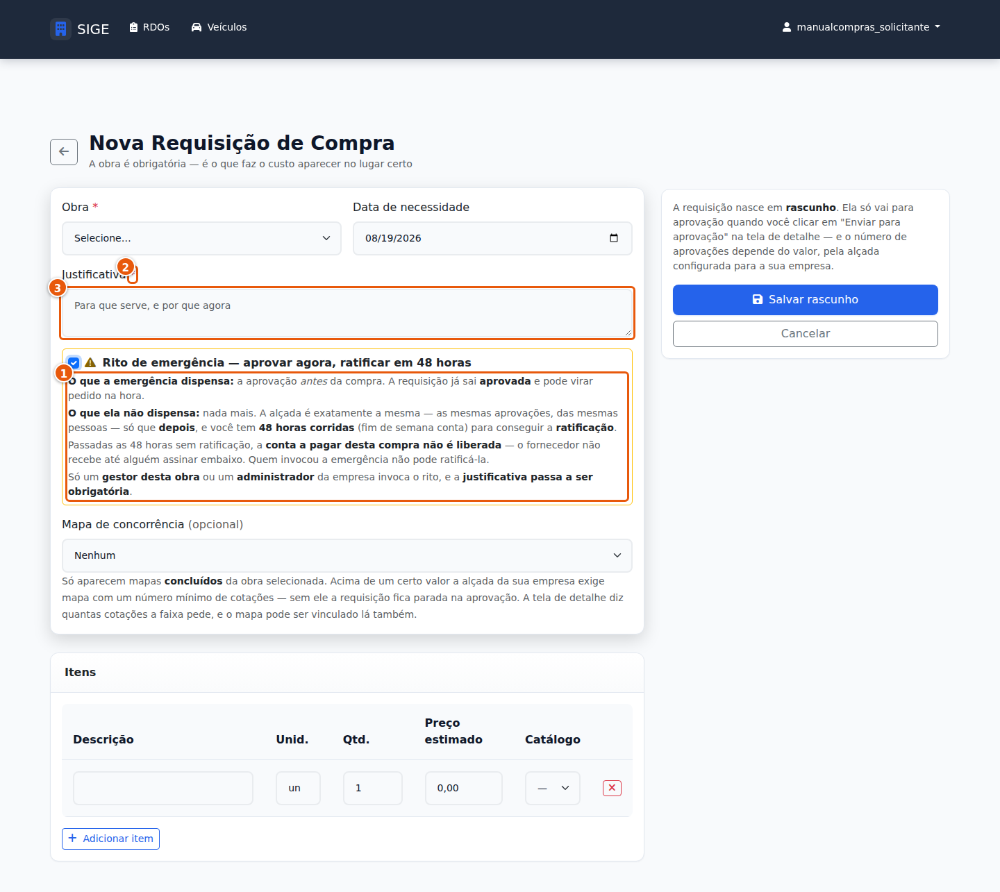

| # | Campo | O que preencher |
|---|---|---|
| 1 | O aviso do rito | Ele diz o que a emergência custa: a compra anda sem aprovação prévia, mas fica devendo ratificação em 48 h. |
| 2 | O asterisco que apareceu | — |
| 3 | Justificativa — agora obrigatória * | É o preço da dispensa de aprovação, e é o que os ratificadores vão ler nas próximas 48 horas. |

> ⚠️ **Atenção:** Sem justificativa o botão não envia. Não é implicância da tela: requisição emergencial sem texto ficaria no banco marcada como emergência e ninguém conseguiria ratificá-la.

### 5. O que acontece se faltar item

**Quem faz:** solicitante · **Onde:** `/compras/requisicoes/nova`

A recusa mais comum de todas, e a que mais confunde: a requisição precisa de pelo menos UMA linha de item.

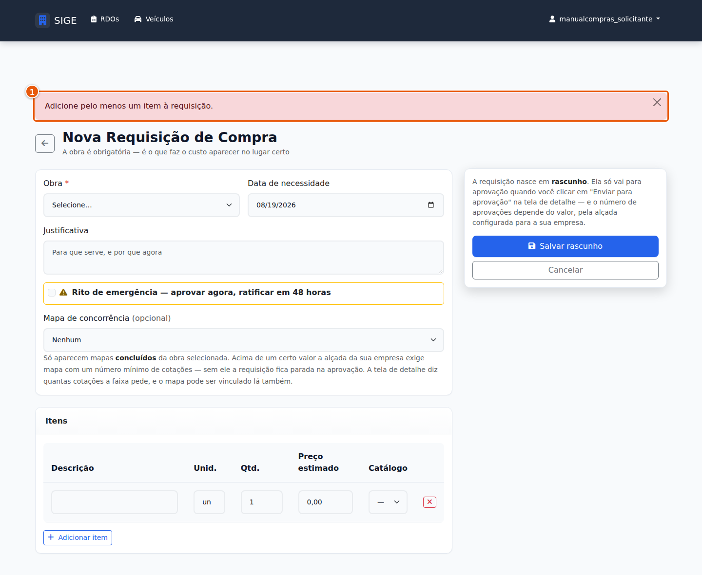

| # | Campo | O que preencher |
|---|---|---|
| 1 | A recusa | Linha em branco não conta como item. Se você digitou a descrição mas deixou quantidade ou preço vazios, a linha é descartada e cai aqui. |

> ⚠️ **Atenção:** Nada foi gravado. A requisição não chegou a existir — volte, preencha a linha e salve de novo.

### 6. Quantas aprovações vai precisar

**Quem faz:** solicitante · **Onde:** `/compras/requisicoes/nova`

Ao salvar, o sistema já diz quantas assinaturas aquele valor exige. O número sai da faixa de alçada da empresa, não do acaso.

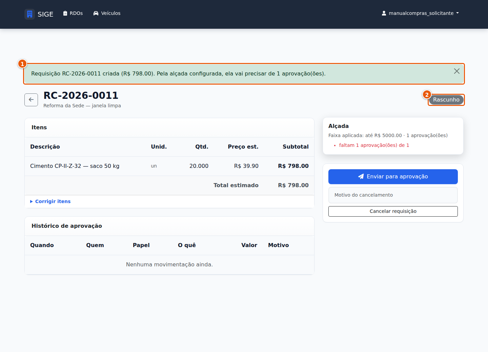

| # | Campo | O que preencher |
|---|---|---|
| 1 | O aviso da alçada | — |
| 2 | O estado: RASCUNHO | — |

> **O que acontece:** A requisição existe, em RASCUNHO. O número de aprovações sai da FAIXA em que o valor cai — trocar os valores das faixas é configuração, não é código.

> ⚠️ **Atenção:** Com as alçadas avançadas ligadas este mesmo aviso ganha uma segunda linha quando o somado da janela sobe a faixa (o anti-fracionamento). 📌 Este manual foi capturado com elas DESLIGADAS, que é como o tenant está — ver a decisão D2 do plano de 18/08.

### 7. Conferir e ajustar os itens

**Quem faz:** solicitante · **Onde:** `/compras/requisicoes/9345`

Enquanto está em RASCUNHO, tudo é editável. É aqui que você corrige quantidade, acrescenta linha ou tira item.

| # | Campo | O que preencher |
|---|---|---|
| 1 | Bloco de itens | — |

> ⚠️ **Atenção:** Depois de enviar para aprovação, esta edição some. Confira agora. Se a sua empresa exigir cotação para esta faixa de valor, aparece aqui também um bloco para vincular o mapa de cotação — ele só existe quando a regra de alçada pede.

### 8. Enviar para aprovação

**Quem faz:** solicitante · **Onde:** `/compras/requisicoes/9345`

O ato que tira a requisição das suas mãos.

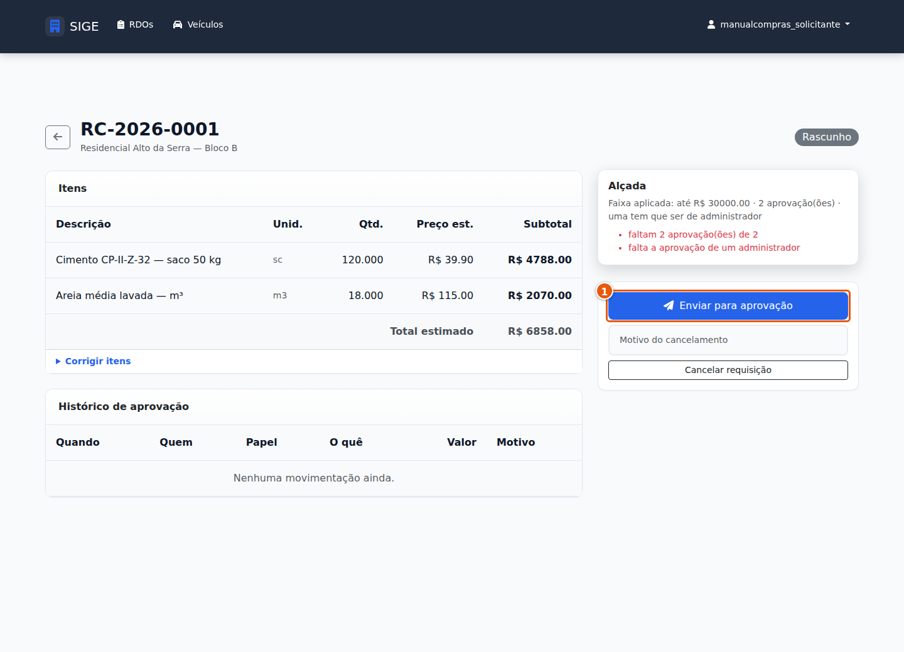

| # | Campo | O que preencher |
|---|---|---|
| 1 | Enviar para aprovação | — |

> **O que acontece:** A requisição vai para AGUARDANDO APROVAÇÃO e aparece na fila de quem aprova. A partir daqui você só acompanha.

### 9. Depois de enviar, o que sobra para você

**Quem faz:** solicitante · **Onde:** `/compras/requisicoes/9346`

A mesma requisição, agora fora do seu alcance. Esta tela existe para você reconhecer o estado — e não procurar um botão que deixou de existir.

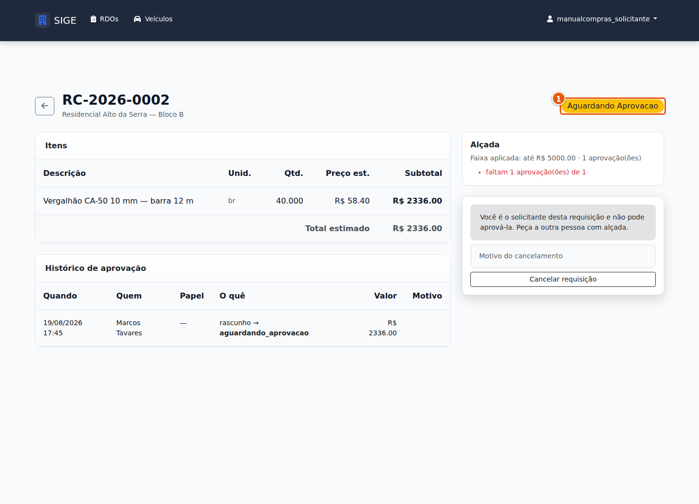

| # | Campo | O que preencher |
|---|---|---|
| 1 | O estado: AGUARDANDO APROVAÇÃO | — |

> ⚠️ **Atenção:** O bloco de itens não é mais editável e o botão de enviar sumiu. Não é falha: enviar é o ato que passa a requisição para outra pessoa. Se estiver errada, peça a quem aprova que REJEITE — a rejeição devolve a requisição para conserto.

### 10. O rito de emergência, do início ao fim

**Quem faz:** solicitante · **Onde:** `/compras/requisicoes/nova`

Bomba quebrou, concretagem para. A emergência aprova na hora — e cria uma dívida: a ratificação em 48 horas.

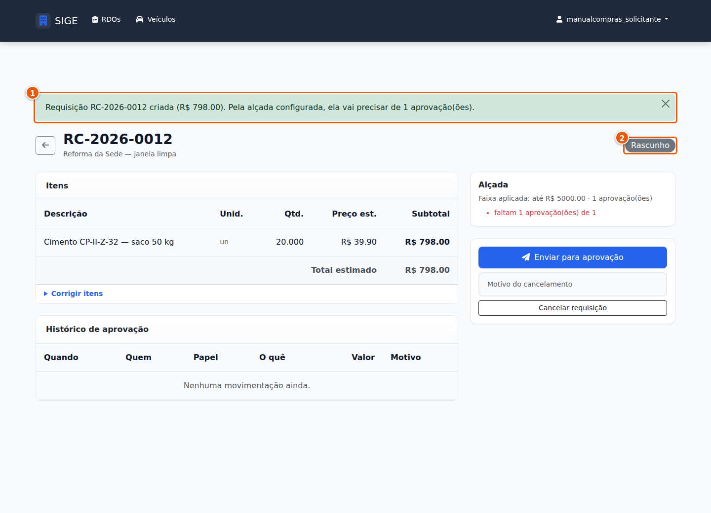

| # | Campo | O que preencher |
|---|---|---|
| 1 | O que o sistema respondeu | — |
| 2 | O estado: APROVADA, sem passar pela fila | — |

> **O que acontece:** A requisição já pode virar pedido. Mas ela nasce DEVENDO: enquanto ninguém ratificar, a conta a pagar desta compra não é liberada.

> ⚠️ **Atenção:** Quem ratifica é um gestor da obra ou um administrador — e a ratificação usa a mesma tela de aprovar. O prazo aparece no painel da própria requisição.

## Ato 2 — Quem responde pela obra, decide

A gerência aprova, rejeita ou devolve para conserto.

### 11. A fila de aprovação

**Quem faz:** gestor · **Onde:** `/compras/aprovacao`

Tudo que está esperando a sua decisão, em um lugar só.

### 12. Aprovar

**Quem faz:** gestor · **Onde:** `/compras/requisicoes/9346`

Você vê o que foi pedido, para qual obra e quanto custa por estimativa. Aprovar libera a compra — não a faz.

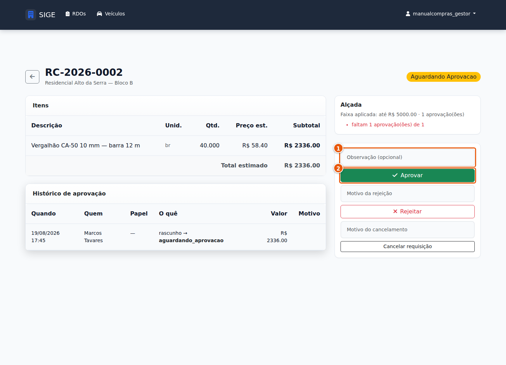

| # | Campo | O que preencher |
|---|---|---|
| 1 | Observação | Opcional, mas é o que o comprador vai ler antes de negociar. |
| 2 | Aprovar | — |

> **O que acontece:** A requisição vai para APROVADA e some da sua fila.

### 13. Rejeitar

**Quem faz:** gestor · **Onde:** `/compras/requisicoes/9346`

Rejeitar não é matar o pedido. É devolver para conserto.

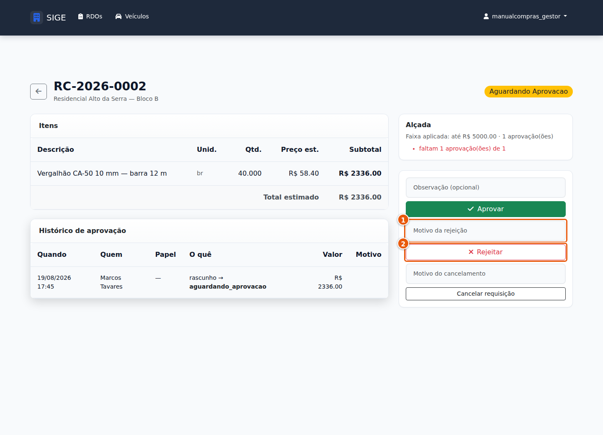

| # | Campo | O que preencher |
|---|---|---|
| 1 | Motivo * | Escreva o que precisa mudar. É a única coisa que o solicitante vai ver. |
| 2 | Rejeitar | — |

> **O que acontece:** A requisição volta para o solicitante, marcada como REJEITADA, com o seu motivo à vista.

### 14. Corrigir e reenviar

**Quem faz:** solicitante · **Onde:** `/compras/requisicoes/9347`

Foi rejeitada. Você lê o motivo, conserta e manda de novo — sem começar do zero.

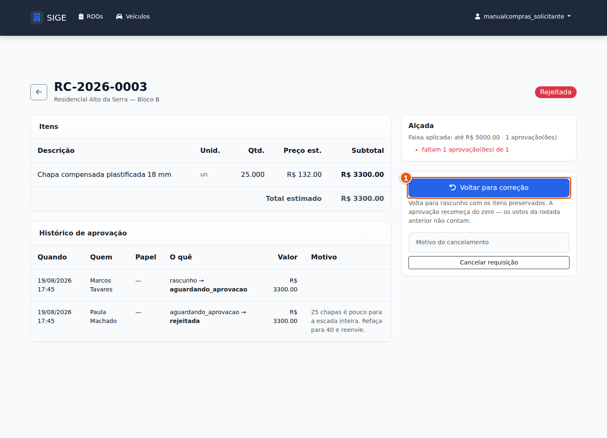

| # | Campo | O que preencher |
|---|---|---|
| 1 | Corrigir requisição | — |

> **O que acontece:** Ela volta para RASCUNHO, editável de novo. O histórico guarda os dois momentos: a rejeição e a correção.

> ⚠️ **Atenção:** Requisição rejeitada NÃO está perdida. Se você não achar este botão, você está olhando a requisição de outra pessoa.

### 15. Aprovada — e agora?

**Quem faz:** solicitante · **Onde:** `/compras/requisicoes/9348`

A requisição voltou aprovada. Este é o ponto em que se descobre quem pode transformá-la em compra.

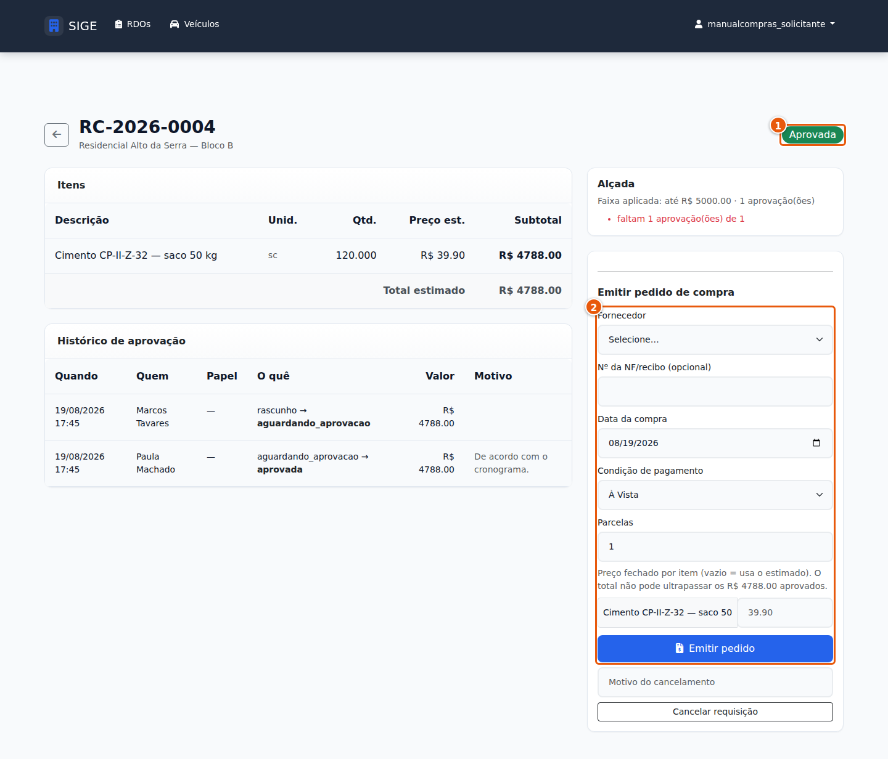

| # | Campo | O que preencher |
|---|---|---|
| 1 | O estado: APROVADA | — |
| 2 | O bloco de emitir pedido | — |

> ⚠️ **Atenção:** Se este bloco NÃO aparece para você, não é falha do sistema: é o seu papel NESTA obra. 📖 Emitir pedido é do COMPRADOR; quem é só Gestor aprova e não emite, e quem não tem vínculo nenhum com a obra não vê nem a requisição. Foi essa a confusão mais cara da implantação — a tela some inteira e parece defeito.

## Ato 3 — Quem compra, negocia

A requisição aprovada vira pedido, com fornecedor e valor real.

### 16. Emitir o pedido de compra

**Quem faz:** comprador · **Onde:** `/compras/requisicoes/9348`

A requisição vira pedido. Aqui entra o fornecedor escolhido e o valor REAL negociado.

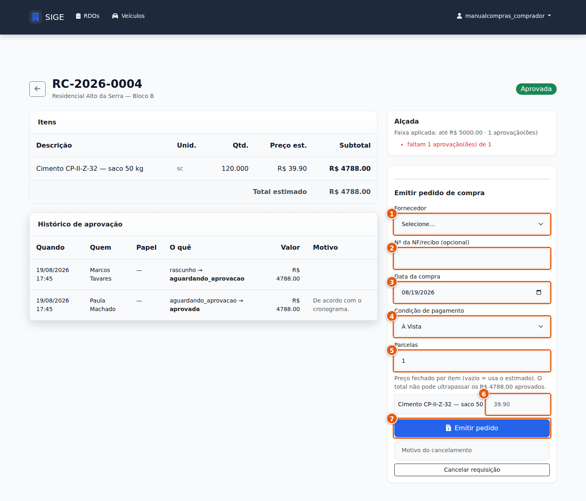

| # | Campo | O que preencher |
|---|---|---|
| 1 | Fornecedor * | Obrigatório. |
| 2 | Número do pedido | Em branco, o sistema numera sozinho. |
| 3 | Data da compra * | Obrigatório. |
| 4 | Condição de pagamento * | É o que define quando a conta vence. |
| 5 | Parcelas | — |
| 6 | Preço fechado por item | O valor que você NEGOCIOU. Em branco, vale o estimado da requisição. O total não pode passar do que foi aprovado — se passou, volte para uma requisição nova. |
| 7 | Emitir pedido | — |

> **O que acontece:** Nasce o pedido de compra E nasce a conta a pagar. A requisição vira CONVERTIDA e não muda mais de estado.

> ⚠️ **Atenção:** Deste ponto não se volta pela requisição. Desfazer é excluir o pedido, que é outra operação. E se este bloco não aparecer para você, é o seu papel NESTA obra: emitir pedido é do Comprador. Quem é Gestor aprova, mas não emite — é a mesma separação que impede aprovar a própria compra.

## Ato 4 — Quem paga, confere

A conta só é paga quando pedido, atesto e nota fecham.

### 17. O painel das três pernas

**Quem faz:** admin · **Onde:** `/compras/11723`

A conta nasceu BLOQUEADA. Ela só pode ser paga quando as três pernas fecham: o pedido, o recebimento com atesto e a nota fiscal. O painel diz qual falta.

> ⚠️ **Atenção:** Se você tentar pagar agora, o sistema recusa e diz o que está faltando. Não é travamento: é o controle funcionando.

### 18. Receber e atestar

**Quem faz:** admin · **Onde:** `/compras/11723/recebimento`

O material chegou. Quem recebe confere e atesta a quantidade — e é isso que autoriza o pagamento, não a nota.

| # | Campo | O que preencher |
|---|---|---|
| 1 | Data do recebimento * | Obrigatório. |
| 2 | Quantidade recebida * | A quantidade REAL que chegou. Se veio menos, ponha menos: o saldo continua em aberto. |
| 3 | Encerrar o saldo | Marque quando o fornecedor não vai mais entregar o resto. |
| 4 | Observação | — |

> **O que acontece:** A perna do atesto fecha e o valor atestado aparece no painel.

### 19. Lançar a nota fiscal

**Quem faz:** admin · **Onde:** `/compras/11724/nota`

A terceira perna. Sem ela a conta continua bloqueada.

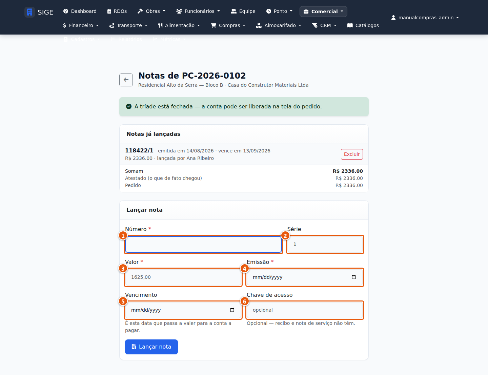

| # | Campo | O que preencher |
|---|---|---|
| 1 | Número da nota * | Obrigatório. |
| 2 | Série | — |
| 3 | Valor total * | Use vírgula para os centavos: 2.336,00. O sistema recusa valor ambíguo em vez de adivinhar. |
| 4 | Data de emissão * | Obrigatório. |
| 5 | Vencimento * | Obrigatório. |
| 6 | Chave de acesso | — |

> **O que acontece:** Com pedido, atesto e nota, a tríade fecha.

> ⚠️ **Atenção:** Só quem é administrador lança nota. Se o campo não aparece para você, é o seu perfil.

### 20. Liberar para pagamento

**Quem faz:** admin · **Onde:** `/compras/11724`

Tríade fechada. Este é o botão que destrava a conta.

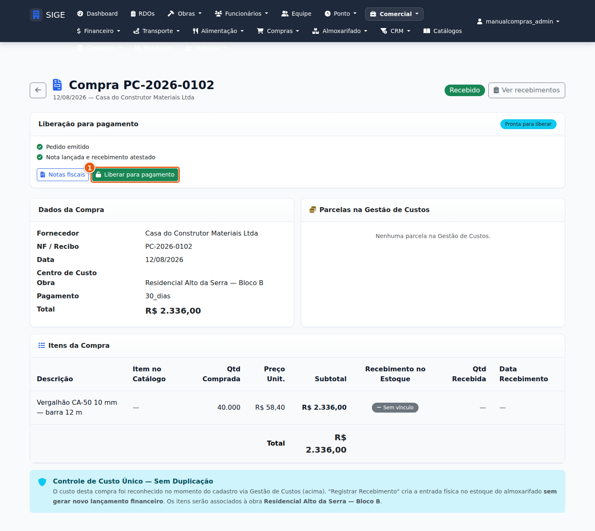

| # | Campo | O que preencher |
|---|---|---|
| 1 | Liberar para pagamento | — |

> **O que acontece:** A conta sai de BLOQUEADA e passa a aceitar baixa.

> ⚠️ **Atenção:** Se faltar uma perna, o botão vira "Liberar com ressalva" e exige uma justificativa de pelo menos 15 caracteres. É exceção auditável — fica registrada com o seu nome.

### 21. Dar baixa na conta

**Quem faz:** admin · **Onde:** `/financeiro/contas-pagar/4018/pagar`

A conta liberada finalmente aceita o pagamento.

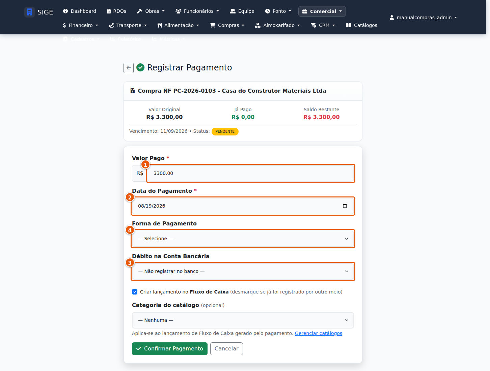

| # | Campo | O que preencher |
|---|---|---|
| 1 | Valor pago * | Pode ser parcial: o saldo continua em aberto. |
| 2 | Data do pagamento * | Obrigatório. |
| 3 | Banco * | De qual conta saiu o dinheiro. |
| 4 | Forma de pagamento | — |

> **O que acontece:** A conta vira PAGA e o saldo do banco desce.

### 22. Montar o lote de pagamento

**Quem faz:** admin · **Onde:** `/financeiro/fechamento-pagamentos`

Em vez de pagar uma a uma, junte as contas do ciclo num lote. Quem monta e quem fecha devem ser pessoas diferentes.

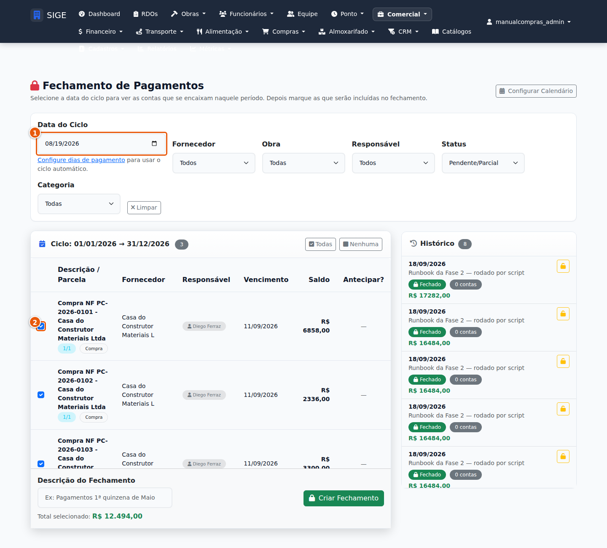

| # | Campo | O que preencher |
|---|---|---|
| 1 | Data do fechamento * | Obrigatório. |
| 2 | Contas do lote * | Marque as que entram neste pagamento. |

> **O que acontece:** O lote fecha com o nome de quem fechou. É a segregação de função: quem monta não fecha.
