# Compras, do pedido ao pagamento

Manual de uso do SIGE. Gerado por `scripts/gerar_manual_compras.py` a partir de `scripts/roteiro_manual_compras.py` — **não edite este arquivo à mão**: edite o roteiro e gere de novo.

## Antes de tudo

Entrar no sistema.

### 1. Entrar no sistema

**Quem faz:** anon · **Onde:** `/login`

Todo mundo entra por aqui. O que você vê depois depende do seu perfil: quem pede vê a obra, quem aprova vê a fila.

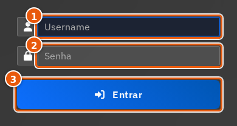

| # | Campo | O que preencher |
|---|---|---|
| 1 | Usuário ou e-mail * | Obrigatório. |
| 2 | Senha * | Obrigatório. |
| 3 | Entrar | — |

> **O que acontece:** O sistema abre na tela inicial do seu perfil.

## Ato 1 — Quem precisa, pede

O encarregado da obra abre a requisição. Nada foi comprado ainda.

### 2. A lista de requisições

**Quem faz:** solicitante · **Onde:** `/compras/requisicoes`

O ponto de partida de toda compra. Aqui estão as suas requisições e em que pé cada uma está.

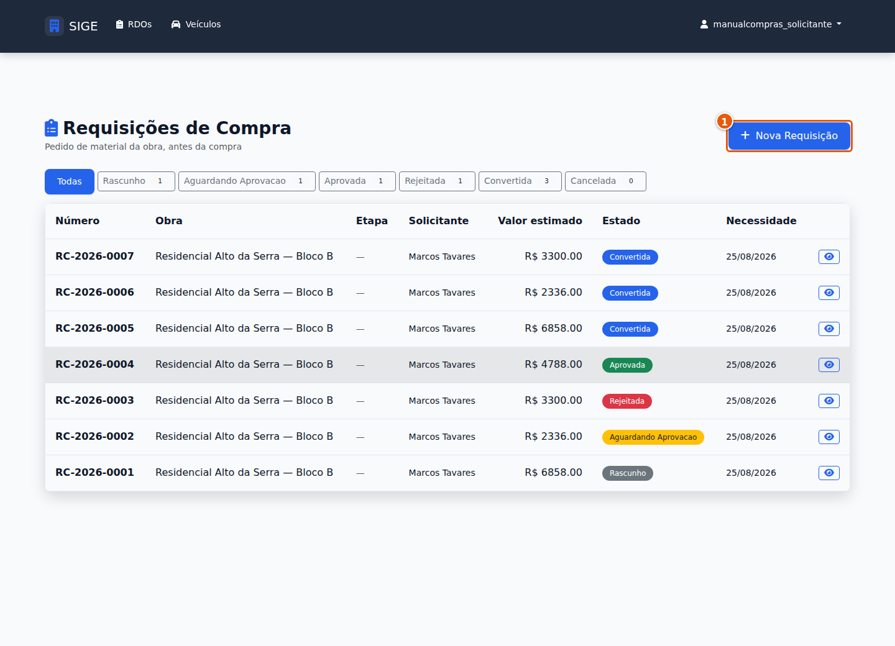

| # | Campo | O que preencher |
|---|---|---|
| 1 | Nova requisição | — |

> ⚠️ **Atenção:** Se você tentar ir direto em Compras → Nova compra, o sistema traz você de volta para cá. Com a governança de compras ligada, toda compra começa por uma requisição — não dá para pular.

### 3. Preencher a requisição

**Quem faz:** solicitante · **Onde:** `/compras/requisicoes/nova`

Onde você diz o que precisa, para qual obra e para quando. O preço é ESTIMADO: quem fecha o valor é o comprador, depois.

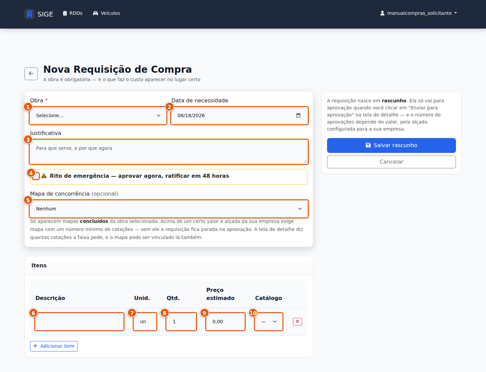

| # | Campo | O que preencher |
|---|---|---|
| 1 | Obra * | Sem obra a requisição não existe — é o que faz o custo chegar no lugar certo. |
| 2 | Data de necessidade | Quando o material tem de estar na obra, não quando você quer que seja comprado. |
| 3 | Justificativa | Opcional no dia a dia — MAS vira obrigatória se você marcar o campo 4. |
| 4 | Rito de emergência | Marque só quando for. Ao marcar, a justificativa passa a ser exigida e a aprovação segue outro caminho. |
| 5 | Mapa de concorrência | Se já existe cotação para este material, ligue aqui. Quando a empresa exige cotação, este campo passa a ser cobrado na aprovação. |
| 6 | Descrição do item * | Obrigatório. |
| 7 | Unidade * | sc, m³, br, un — a mesma que o fornecedor usa na nota. |
| 8 | Quantidade * | Obrigatório. |
| 9 | Preço estimado | Chute informado. Serve para a aprovação saber a ordem de grandeza. |
| 10 | Catálogo | Ligando ao catálogo, a entrada no estoque sai automática quando o material chegar. |

> **O que acontece:** A requisição nasce em RASCUNHO. Ela ainda é sua: ninguém foi avisado e nada foi comprado.

### 4. Conferir e ajustar os itens

**Quem faz:** solicitante · **Onde:** `/compras/requisicoes/8028`

Enquanto está em RASCUNHO, tudo é editável. É aqui que você corrige quantidade, acrescenta linha ou tira item.

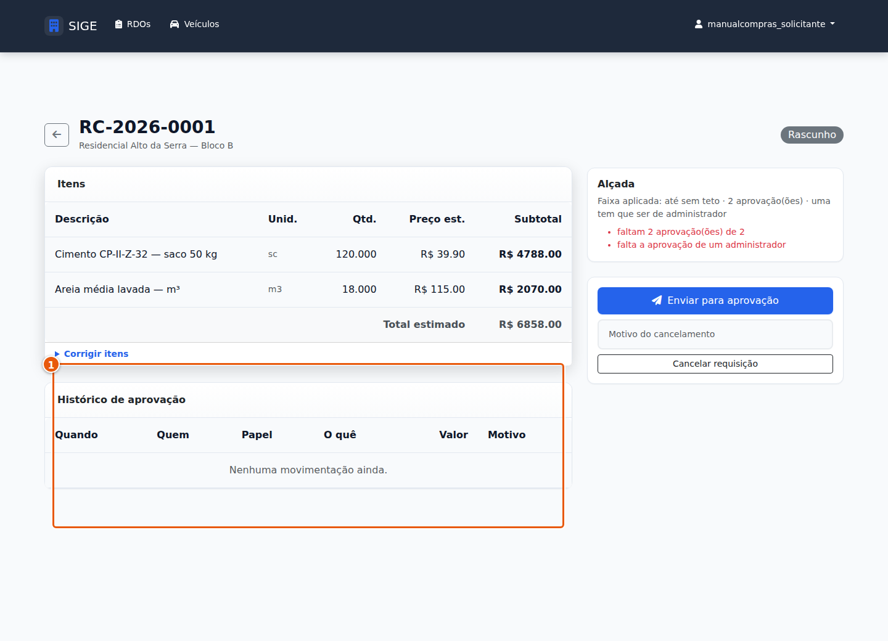

| # | Campo | O que preencher |
|---|---|---|
| 1 | Bloco de itens | — |

> ⚠️ **Atenção:** Depois de enviar para aprovação, esta edição some. Confira agora. Se a sua empresa exigir cotação para esta faixa de valor, aparece aqui também um bloco para vincular o mapa de cotação — ele só existe quando a regra de alçada pede.

### 5. Enviar para aprovação

**Quem faz:** solicitante · **Onde:** `/compras/requisicoes/8028`

O ato que tira a requisição das suas mãos.

| # | Campo | O que preencher |
|---|---|---|
| 1 | Enviar para aprovação | — |

> **O que acontece:** A requisição vai para AGUARDANDO APROVAÇÃO e aparece na fila de quem aprova. A partir daqui você só acompanha.

## Ato 2 — Quem responde pela obra, decide

A gerência aprova, rejeita ou devolve para conserto.

### 6. A fila de aprovação

**Quem faz:** gestor · **Onde:** `/compras/aprovacao`

Tudo que está esperando a sua decisão, em um lugar só.

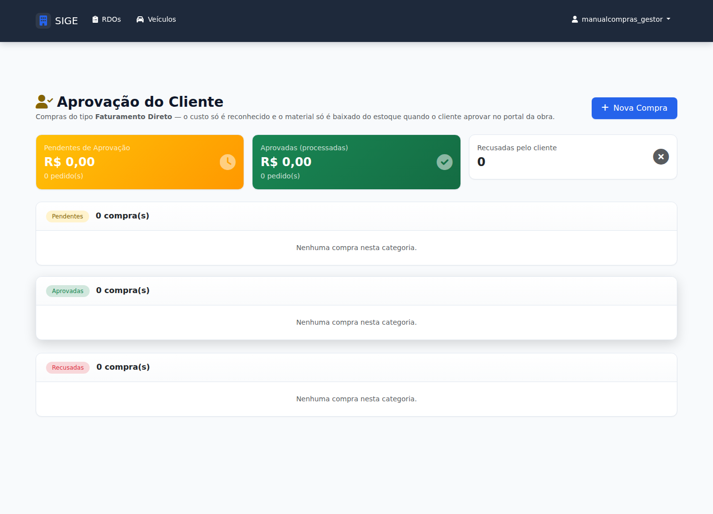

### 7. Aprovar

**Quem faz:** gestor · **Onde:** `/compras/requisicoes/8029`

Você vê o que foi pedido, para qual obra e quanto custa por estimativa. Aprovar libera a compra — não a faz.

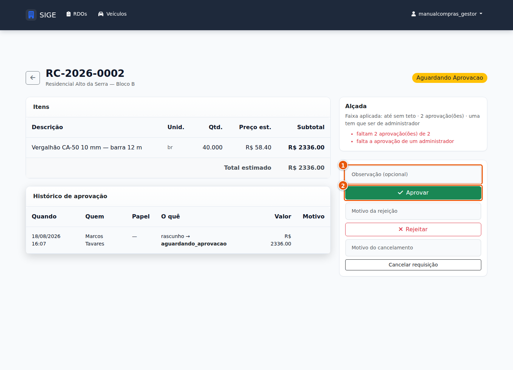

| # | Campo | O que preencher |
|---|---|---|
| 1 | Observação | Opcional, mas é o que o comprador vai ler antes de negociar. |
| 2 | Aprovar | — |

> **O que acontece:** A requisição vai para APROVADA e some da sua fila.

### 8. Rejeitar

**Quem faz:** gestor · **Onde:** `/compras/requisicoes/8029`

Rejeitar não é matar o pedido. É devolver para conserto.

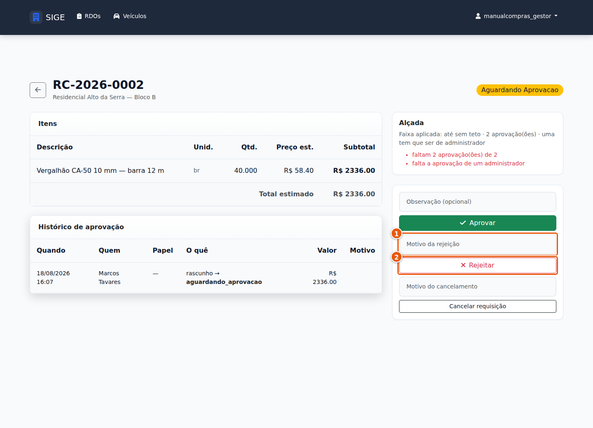

| # | Campo | O que preencher |
|---|---|---|
| 1 | Motivo * | Escreva o que precisa mudar. É a única coisa que o solicitante vai ver. |
| 2 | Rejeitar | — |

> **O que acontece:** A requisição volta para o solicitante, marcada como REJEITADA, com o seu motivo à vista.

### 9. Corrigir e reenviar

**Quem faz:** solicitante · **Onde:** `/compras/requisicoes/8030`

Foi rejeitada. Você lê o motivo, conserta e manda de novo — sem começar do zero.

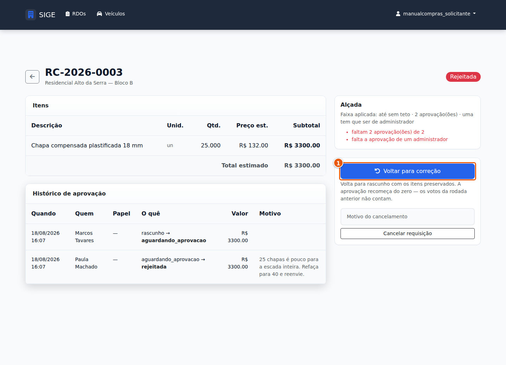

| # | Campo | O que preencher |
|---|---|---|
| 1 | Corrigir requisição | — |

> **O que acontece:** Ela volta para RASCUNHO, editável de novo. O histórico guarda os dois momentos: a rejeição e a correção.

> ⚠️ **Atenção:** Requisição rejeitada NÃO está perdida. Se você não achar este botão, você está olhando a requisição de outra pessoa.

## Ato 3 — Quem compra, negocia

A requisição aprovada vira pedido, com fornecedor e valor real.

### 10. Emitir o pedido de compra

**Quem faz:** comprador · **Onde:** `/compras/requisicoes/8031`

A requisição vira pedido. Aqui entra o fornecedor escolhido e o valor REAL negociado.

| # | Campo | O que preencher |
|---|---|---|
| 1 | Fornecedor * | Obrigatório. |
| 2 | Número do pedido | Em branco, o sistema numera sozinho. |
| 3 | Data da compra * | Obrigatório. |
| 4 | Condição de pagamento * | É o que define quando a conta vence. |
| 5 | Parcelas | — |
| 6 | Preço fechado por item | O valor que você NEGOCIOU. Em branco, vale o estimado da requisição. O total não pode passar do que foi aprovado — se passou, volte para uma requisição nova. |
| 7 | Emitir pedido | — |

> **O que acontece:** Nasce o pedido de compra E nasce a conta a pagar. A requisição vira CONVERTIDA e não muda mais de estado.

> ⚠️ **Atenção:** Deste ponto não se volta pela requisição. Desfazer é excluir o pedido, que é outra operação. E se este bloco não aparecer para você, é o seu papel NESTA obra: emitir pedido é do Comprador. Quem é Gestor aprova, mas não emite — é a mesma separação que impede aprovar a própria compra.

## Ato 4 — Quem paga, confere

A conta só é paga quando pedido, atesto e nota fecham.

### 11. O painel das três pernas

**Quem faz:** admin · **Onde:** `/compras/10398`

A conta nasceu BLOQUEADA. Ela só pode ser paga quando as três pernas fecham: o pedido, o recebimento com atesto e a nota fiscal. O painel diz qual falta.

> ⚠️ **Atenção:** Se você tentar pagar agora, o sistema recusa e diz o que está faltando. Não é travamento: é o controle funcionando.

### 12. Receber e atestar

**Quem faz:** admin · **Onde:** `/compras/10398/recebimento`

O material chegou. Quem recebe confere e atesta a quantidade — e é isso que autoriza o pagamento, não a nota.

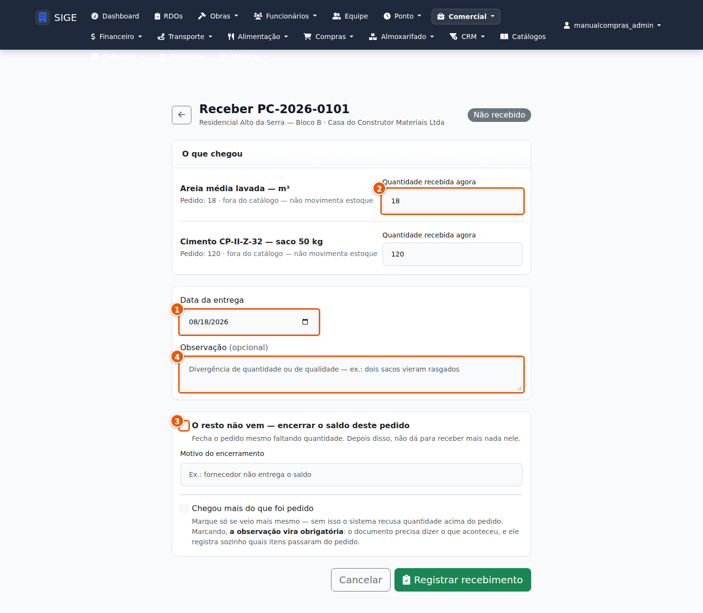

| # | Campo | O que preencher |
|---|---|---|
| 1 | Data do recebimento * | Obrigatório. |
| 2 | Quantidade recebida * | A quantidade REAL que chegou. Se veio menos, ponha menos: o saldo continua em aberto. |
| 3 | Encerrar o saldo | Marque quando o fornecedor não vai mais entregar o resto. |
| 4 | Observação | — |

> **O que acontece:** A perna do atesto fecha e o valor atestado aparece no painel.

### 13. Lançar a nota fiscal

**Quem faz:** admin · **Onde:** `/compras/10399/nota`

A terceira perna. Sem ela a conta continua bloqueada.

| # | Campo | O que preencher |
|---|---|---|
| 1 | Número da nota * | Obrigatório. |
| 2 | Série | — |
| 3 | Valor total * | Use vírgula para os centavos: 2.336,00. O sistema recusa valor ambíguo em vez de adivinhar. |
| 4 | Data de emissão * | Obrigatório. |
| 5 | Vencimento * | Obrigatório. |
| 6 | Chave de acesso | — |

> **O que acontece:** Com pedido, atesto e nota, a tríade fecha.

> ⚠️ **Atenção:** Só quem é administrador lança nota. Se o campo não aparece para você, é o seu perfil.

### 14. Liberar para pagamento

**Quem faz:** admin · **Onde:** `/compras/10399`

Tríade fechada. Este é o botão que destrava a conta.

| # | Campo | O que preencher |
|---|---|---|
| 1 | Liberar para pagamento | — |

> **O que acontece:** A conta sai de BLOQUEADA e passa a aceitar baixa.

> ⚠️ **Atenção:** Se faltar uma perna, o botão vira "Liberar com ressalva" e exige uma justificativa de pelo menos 15 caracteres. É exceção auditável — fica registrada com o seu nome.

### 15. Dar baixa na conta

**Quem faz:** admin · **Onde:** `/financeiro/contas-pagar/3387/pagar`

A conta liberada finalmente aceita o pagamento.

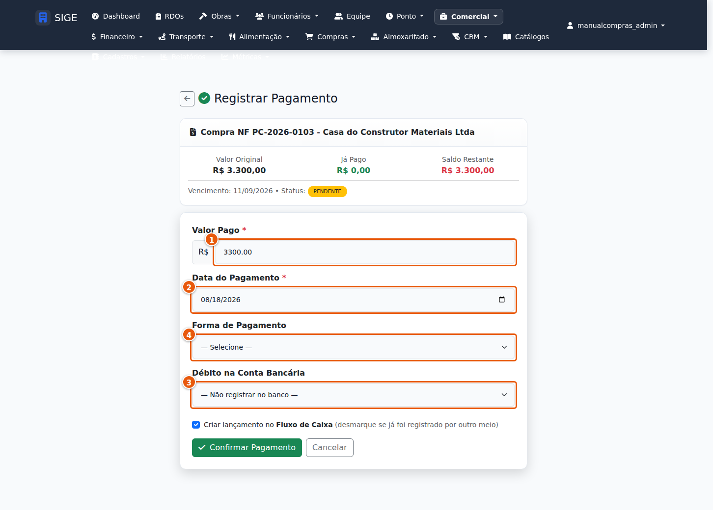

| # | Campo | O que preencher |
|---|---|---|
| 1 | Valor pago * | Pode ser parcial: o saldo continua em aberto. |
| 2 | Data do pagamento * | Obrigatório. |
| 3 | Banco * | De qual conta saiu o dinheiro. |
| 4 | Forma de pagamento | — |

> **O que acontece:** A conta vira PAGA e o saldo do banco desce.

### 16. Montar o lote de pagamento

**Quem faz:** admin · **Onde:** `/financeiro/fechamento-pagamentos`

Em vez de pagar uma a uma, junte as contas do ciclo num lote. Quem monta e quem fecha devem ser pessoas diferentes.

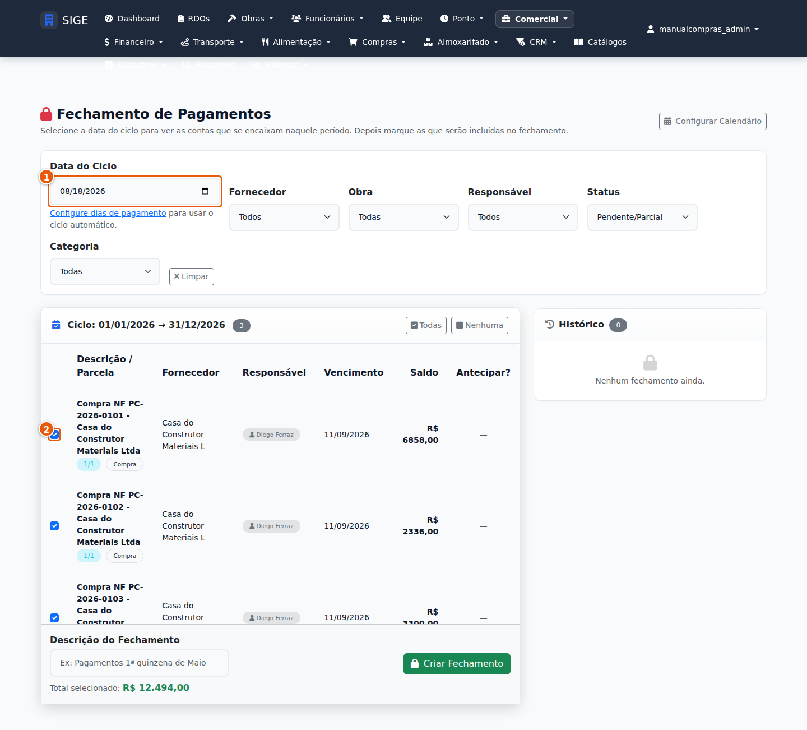

| # | Campo | O que preencher |
|---|---|---|
| 1 | Data do fechamento * | Obrigatório. |
| 2 | Contas do lote * | Marque as que entram neste pagamento. |

> **O que acontece:** O lote fecha com o nome de quem fechou. É a segregação de função: quem monta não fecha.
