# RDO, do cronograma à assinatura

Manual de uso do SIGE. Gerado por `scripts/gerar_manual_rdo.py` a partir de `scripts/roteiro_manual_rdo.py` — **não edite este arquivo à mão**: edite o roteiro e gere de novo.

## Antes de tudo

Entrar, e entender de onde o RDO vem.

### 1. Entrar no sistema

**Quem faz:** anon · **Onde:** `/login`

Quem lança RDO entra com o próprio usuário. O que aparece depois depende do papel na obra: apontador lança e assina; gestor reabre e aprova.

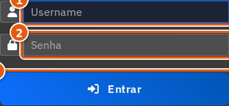

| # | Campo | O que preencher |
|---|---|---|
| 1 | Usuário ou e-mail * | Obrigatório. |
| 2 | Senha * | Obrigatório. |
| 3 | Entrar | — |

### 2. O RDO é alimentado pelo cronograma

**Quem faz:** encarregado · **Onde:** `/cronograma/obra/125046`

As atividades que você vai apontar no RDO são ESTAS. O RDO não tem lista própria: ele lê o cronograma da obra, e cada apontamento volta para cá como avanço.

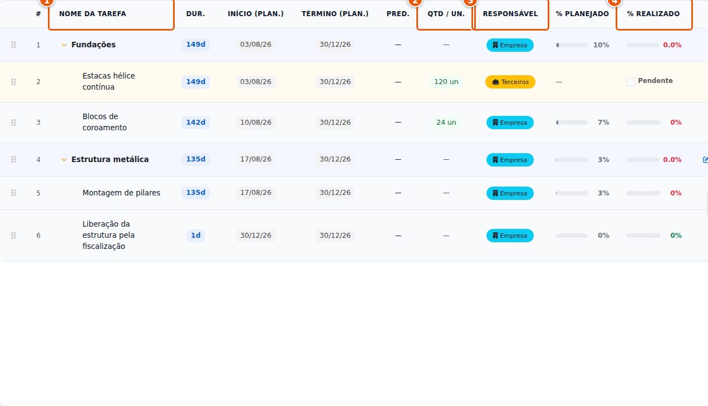

| # | Campo | O que preencher |
|---|---|---|
| 1 | As atividades | Só as folhas (sem filhas) recebem apontamento. As fases somam as filhas. |
| 2 | Qtd / Un. | Atividade com quantidade e unidade é apontada por QUANTIDADE executada no dia. Sem quantidade, por percentual acumulado. |
| 3 | Responsável | "terceiros" é equipe de terceiro — mas o botão de terceiro existe em qualquer atividade. |
| 4 | % Realizado | Calculado automaticamente pelos apontamentos do RDO. Ninguém digita aqui. |

> ⚠️ **Atenção:** RDO em rascunho NÃO mexe nesta coluna. Só o RDO submetido.

### 3. Os RDOs da obra

**Quem faz:** encarregado · **Onde:** `/rdos`

Um RDO por obra, por dia trabalhado. Aqui você vê o que já foi lançado e cria o de hoje.

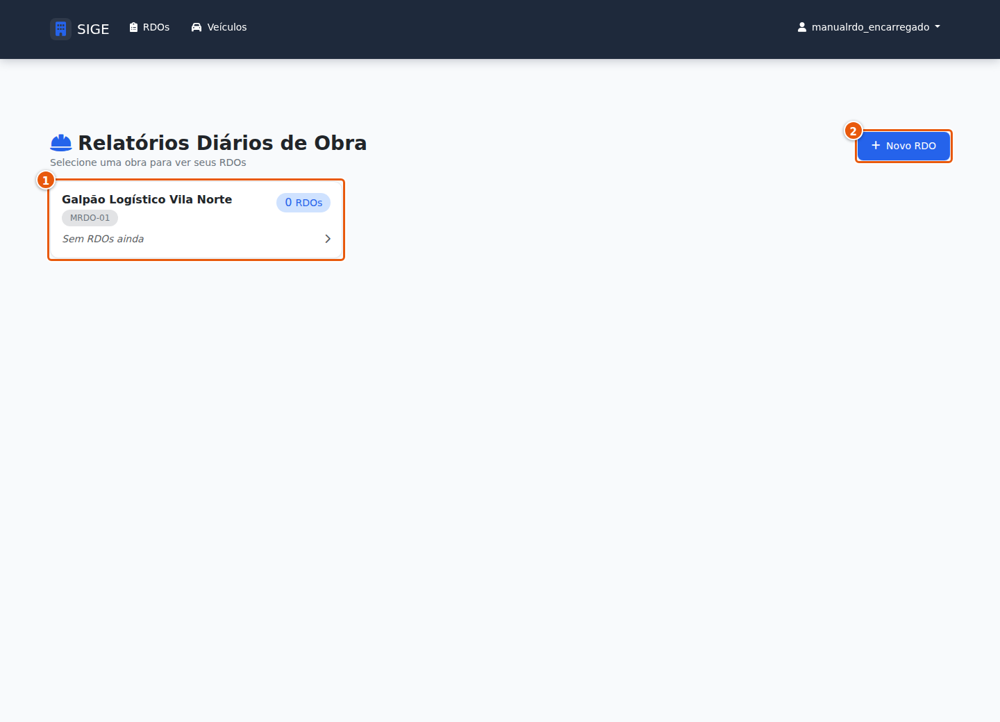

| # | Campo | O que preencher |
|---|---|---|
| 1 | A obra | — |
| 2 | Novo RDO | — |

## Ato 1 — Preencher o dia

Do cabeçalho às fotos, na ordem em que a tela pede.

### 4. Obra, data e clima

**Quem faz:** encarregado · **Onde:** `/rdo/novo?obra_id=125046`

O cabeçalho do dia: qual obra, que dia, como estava o tempo. A data é a do dia trabalhado — e o RDO é lançado no mesmo dia.

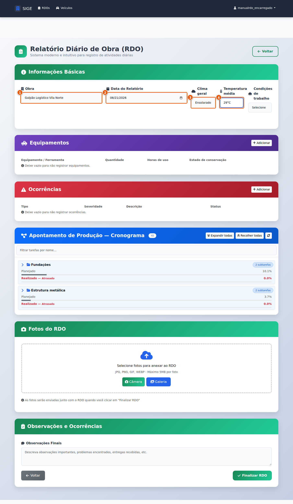

| # | Campo | O que preencher |
|---|---|---|
| 1 | Obra * | Obrigatório. |
| 2 | Data do RDO * | A data do dia trabalhado — lançado NO MESMO DIA. Dois dias de atraso é motivo de devolução. |
| 3 | Clima | É o que sustenta a ocorrência de chuva quando ela vira discussão de prazo. |
| 4 | Temperatura | — |

> **O que acontece:** Ao escolher a obra, as atividades do cronograma aparecem abaixo.

### 5. As atividades, dentro do RDO

**Quem faz:** encarregado · **Onde:** `(mesma tela)`

São as mesmas atividades do cronograma, agrupadas por fase — a fase abre recolhida; "Expandir todas" mostra as folhas. Em cada linha: onde apontar o avanço, e os dois botões — equipe própria e terceiro.

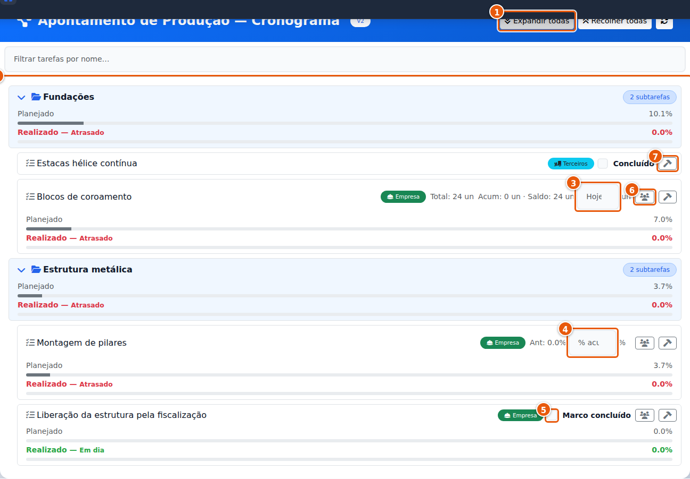

| # | Campo | O que preencher |
|---|---|---|
| 1 | Expandir todas | As fases vêm fechadas. Só a folha recebe apontamento. |
| 2 | As atividades do cronograma | — |
| 3 | Quantidade de HOJE | Atividade por quantidade: o que foi executado hoje, não o acumulado. O sistema soma. |
| 4 | Percentual ACUMULADO | Atividade por percentual: o acumulado da atividade, não o do dia. |
| 5 | Marco | Marque só no dia em que ele de fato ocorreu. |
| 6 | Equipe própria | — |
| 7 | Terceiro | Existe em qualquer atividade, inclusive nas nossas. |

### 6. Equipe própria — só quem é operacional

**Quem faz:** encarregado · **Onde:** `(mesma tela)`

A lista traz só o pessoal OPERACIONAL. A Ana, do escritório, não aparece — a função dela está marcada como administrativa.

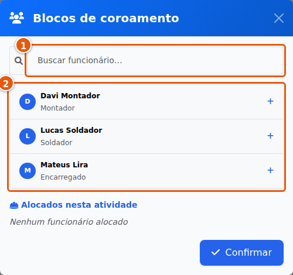

| # | Campo | O que preencher |
|---|---|---|
| 1 | Buscar pelo nome | — |
| 2 | Quem pode ser alocado | Quem trabalhou e não aparece aqui está com a função marcada como administrativa no cadastro — avise o escritório, não deixe de fora. |

### 7. Quem esteve, e quantas horas

**Quem faz:** encarregado · **Onde:** `(mesma tela)`

Cada pessoa com as horas NESTA atividade. Quem trabalhou em duas atividades aparece nas duas, com as horas divididas — a soma bate com a jornada.

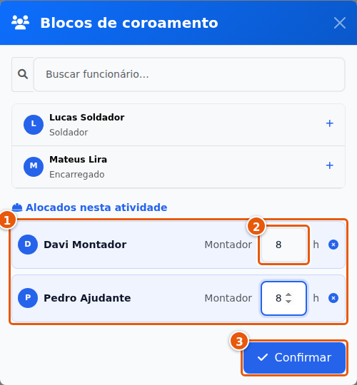

| # | Campo | O que preencher |
|---|---|---|
| 1 | Alocados nesta atividade | — |
| 2 | Horas de cada um * | Obrigatório. |
| 3 | Confirmar | — |

> ⚠️ **Atenção:** Não é aceito: escrever o efetivo em observação, ou só o número de pessoas sem dizer quem.

### 8. Equipe de terceiro

**Quem faz:** encarregado · **Onde:** `(mesma tela)`

"Abraão, 11 pessoas" deixa de ser anotação no papel: nome do cadastro, quantidade de pessoas, horas e — se houver medida física do dia — a produção.

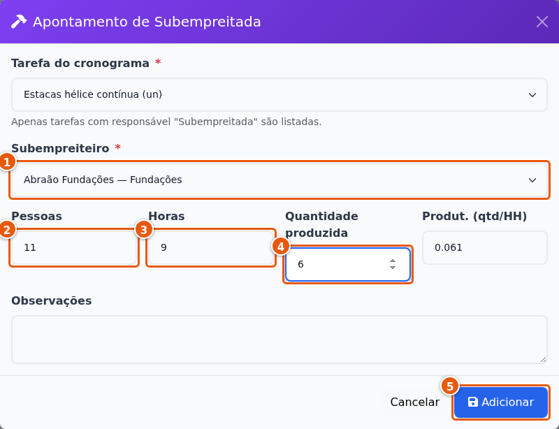

| # | Campo | O que preencher |
|---|---|---|
| 1 | Terceiro (do cadastro) * | Não está cadastrado? Peça o cadastro ao escritório. |
| 2 | Quantidade de pessoas * | É este número que responde depois "em quantos dias, com quantos homens". |
| 3 | Horas da equipe | — |
| 4 | Produção do dia | Só quando houver medida física (un, m², m³). Sem medida, zero — registrar efetivo NÃO move o avanço. |
| 5 | Salvar | — |

> ⚠️ **Atenção:** Não é aceito: anotar "11 pessoas" em observação, ou pular o terceiro porque a atividade é nossa.

### 9. O avanço de quem andou hoje

**Quem faz:** encarregado · **Onde:** `(mesma tela)`

Aponte só as atividades que andaram. Quantidade é a de HOJE; percentual é o ACUMULADO; marco só no dia em que ocorreu.

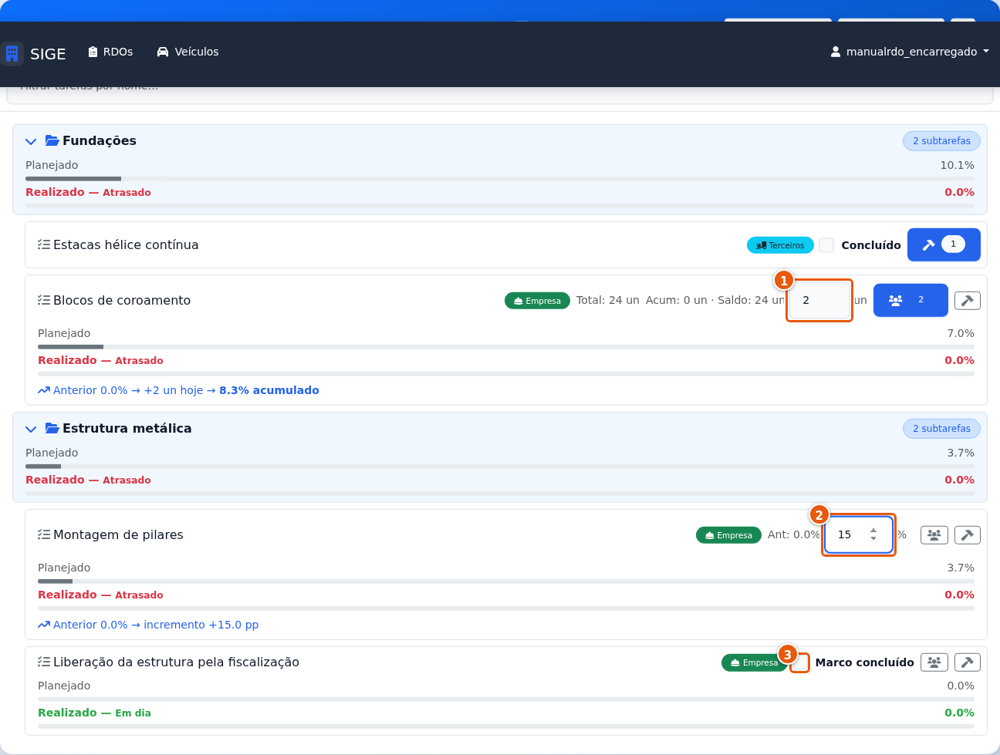

| # | Campo | O que preencher |
|---|---|---|
| 1 | Blocos: 2 hoje | — |
| 2 | Pilares: 15 % acumulado | — |
| 3 | Marco: em branco | A liberação ainda não aconteceu. Em branco. |

> ⚠️ **Atenção:** Não é aceito: repetir o número da véspera para "não deixar vazio", nem apontar 100 % "porque está quase acabando".

### 10. O que aconteceu, quando e qual o efeito

**Quem faz:** encarregado · **Onde:** `(mesma tela)`

"Choveu" não é ocorrência. "Chuva das 10h às 14h, concretagem do bloco B3 adiada" é: diz o que, quando e o efeito.

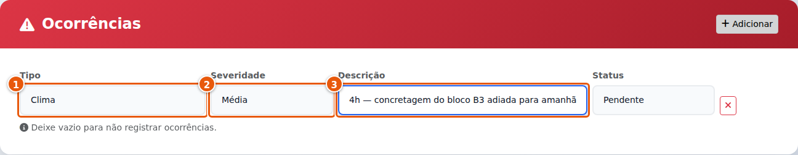

| # | Campo | O que preencher |
|---|---|---|
| 1 | Tipo * | Obrigatório. |
| 2 | Severidade | — |
| 3 | O que, quando, efeito * | Obrigatório. |

> ⚠️ **Atenção:** Não é aceito: dia em que a produção caiu sem ocorrência que explique.

### 11. Três fotos, no mínimo

**Quem faz:** encarregado · **Onde:** `(mesma tela)`

Uma da frente de serviço no início, uma do que foi executado, uma de cada ocorrência física. A foto tem de deixar ver ONDE é.

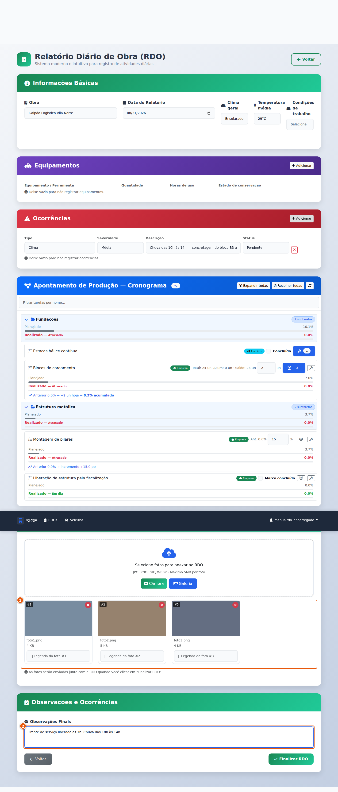

| # | Campo | O que preencher |
|---|---|---|
| 1 | As fotos anexadas | — |
| 2 | Observações finais | — |

> ⚠️ **Atenção:** Ocorrência física (dano, interdição, material errado, alagamento) sem foto é motivo de devolução.

### 12. Salvo — mas ainda é rascunho

**Quem faz:** encarregado · **Onde:** `(mesma tela)`

O RDO nasce em RASCUNHO: é o estado em que ainda se corrige à vontade, quantas vezes for preciso, durante o dia. Rascunho não lança custo — quem fecha o dia e lança o custo é o Submeter.

| # | Campo | O que preencher |
|---|---|---|
| 1 | O estado: Rascunho | — |
| 2 | Submeter — o próximo passo | Os botões disponíveis mudam com o estado: são eles que dizem o que ainda dá para fazer. |

> ⚠️ **Atenção:** RDO esquecido em rascunho é dia sem fecho: sem assinatura, sem valor de documento, e o escritório não considera o dia lançado. É o sexto motivo da lista de devolução.

## Ato 2 — Fechar o dia

Submeter, corrigir se preciso, assinar. Depois disso o documento não se mexe — se retifica.

### 13. Submeter: o fecho do dia

**Quem faz:** encarregado · **Onde:** `/rdo/{rdo_id}`

Submeter fecha o dia: é aqui que o custo de mão de obra é lançado e a medição é recalculada. A partir daqui o RDO só muda se o gestor reabrir. No fim do DIA, não no fim da semana.

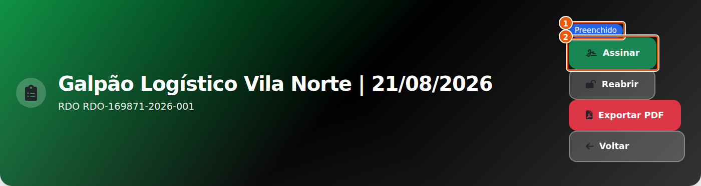

| # | Campo | O que preencher |
|---|---|---|
| 1 | O estado: Preenchido | — |
| 2 | Assinar — o próximo passo | — |

> **O que acontece:** O dia está preenchido. O próximo botão é Assinar.

### 14. Errou? O gestor reabre

**Quem faz:** gestor · **Onde:** `/rdo/{rdo_id}`

Enquanto está PREENCHIDO, o RDO ainda é corrigível: o gestor reabre (com motivo), ele volta a rascunho, você corrige e submete de novo.

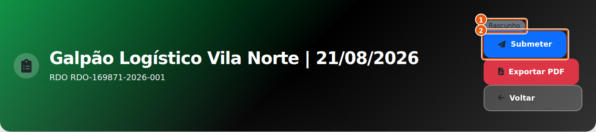

| # | Campo | O que preencher |
|---|---|---|
| 1 | Voltou a Rascunho | — |
| 2 | Submeter reapareceu | — |

> ⚠️ **Atenção:** O motivo é obrigatório e fica registrado. Aqui: "Faltou a hora da chuva na ocorrência".

### 15. Corrigiu, submete de novo

**Quem faz:** encarregado · **Onde:** `/rdo/{rdo_id}`

O mesmo botão. O histórico guarda a reabertura e a nova submissão.

| # | Campo | O que preencher |
|---|---|---|
| 1 | Preenchido outra vez | — |
| 2 | Assinar | — |

### 16. Assinar: vira documento

**Quem faz:** encarregado · **Onde:** `/rdo/{rdo_id}`

A assinatura é o que dá ao RDO valor de documento. Depois dela, nada mais é editado — de propósito.

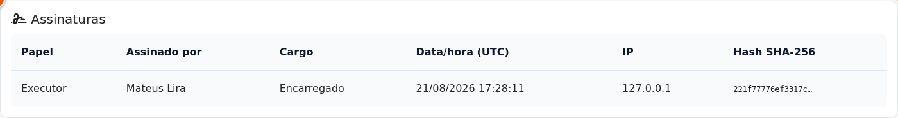

| # | Campo | O que preencher |
|---|---|---|
| 1 | A assinatura registrada: quem, como e quando | Daqui em diante nenhum campo é editável. |

> ⚠️ **Atenção:** Nunca crie um segundo RDO do mesmo dia "por fora" para consertar. Ou se reabre antes de assinar, ou se retifica depois.

### 17. Aprovar: o aceite do gestor

**Quem faz:** gestor · **Onde:** `/rdo/{rdo_id}`

O gestor da obra aceita o dia. Estado final.

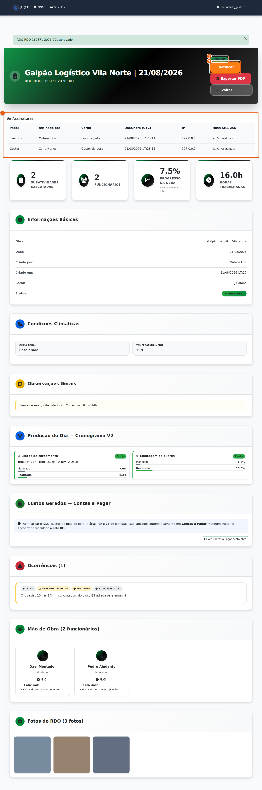

| # | Campo | O que preencher |
|---|---|---|
| 1 | O estado: Aprovado | — |
| 2 | O único botão que resta é Retificar | — |
| 3 | Duas assinaturas: quem executou e quem aprovou | — |

### 18. Achou erro depois? Retifica

**Quem faz:** gestor · **Onde:** `/rdo/{rdo_id}`

Um documento de data não se apaga — se retifica. O sistema emite um NOVO RDO da mesma data, e marca o original como retificado. Os dois ficam, e a correção é rastreável.

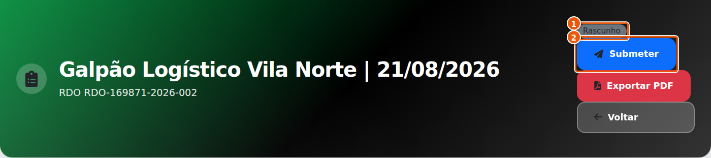

| # | Campo | O que preencher |
|---|---|---|
| 1 | O retificador nasce em Rascunho | — |
| 2 | Preencha e submeta pelo mesmo caminho | — |

> **O que acontece:** Motivo registrado: "Quantidade de estacas do dia era 5, não 6". Preencha o retificador como o original, dizendo o que o primeiro deveria ter dito, e feche pelo mesmo caminho.
